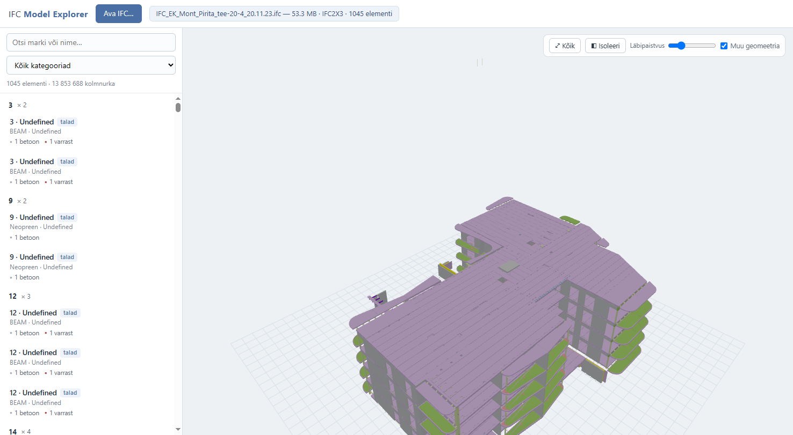
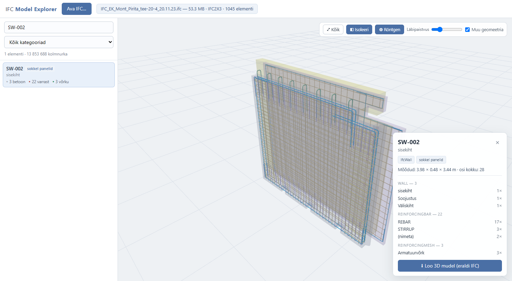
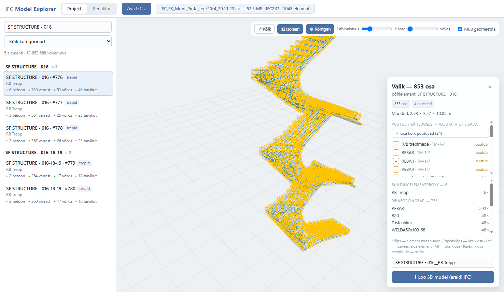

# 🧊 IFC Model Explorer

**Pull any element out of a huge IFC model — with every rebar, mesh and embed inside it — in two clicks.**

Open a 50 MB+ Tekla/BIM project, click a precast element, and save it as a clean standalone
`.ifc` file that contains the complete element: concrete layers, all reinforcement, lifting
anchors, embedded plates — everything, with original GlobalIds, property sets, materials and
placements untouched.

Doing this in the usual tools is painful: viewers like Trimble Connect or Solibri let you *look*
at an element but won't give you a working IFC of just that element, and authoring tools make you
fight reference copies, filters and export dialogs. Here it is one click on the shell — the program
finds everything that belongs inside it automatically, even when the IFC file has **no assembly
relationships at all** (like most Tekla exports).



## What it does

- 🏗 **Opens huge IFC files** (IFC2X3 / IFC4, tested on 53 MB / 30 000+ products) and tessellates
  everything with all CPU cores. The result is cached — reopening the same file is instant.
- 🧠 **Understands precast elements**: groups every cast unit with its internals using Tekla marks
  (`CAST_UNIT_POS`, `Concrete_*`), assemblies, storeys and — where the file has no relations —
  pure geometry (an inflated-bbox containment rule taken from a production-tested extraction
  pipeline).
- 🖱 **Trimble-style 3D navigation**: hover highlights the part under the cursor with an orange
  outline; **clicking the concrete shell** selects the whole element with everything inside it,
  **clicking a rebar/embed** selects just that one part; Ctrl+click builds a custom multi-part
  selection; double-click grabs the whole element from anywhere; Delete removes parts; right-click
  menu for hide/select/copy. Zoom is cursor-centered for fast close-up inspection.
- 🩻 **X-ray & isolate** (they combine): make all concrete ghost-transparent and click *through*
  it to grab reinforcement directly.
- 🤝 **"Touching / nearby" suggestions**: the side panel lists parts that touch the selection
  (joints, grout, anchors) with one-click ➕ add — the list unfolds transitively as you add.
- 📏 **Capture radius slider**: bulk-add everything within N cm of the selection.
- 🙈 **Hide parts** (H / right-click) that block the view, with full **undo/redo** (Ctrl+Z / Ctrl+Y).
- ✂️ **Editor tab**: Ctrl+C any selection, paste it into an empty workspace, delete parts,
  **drag parts to new positions** (Alt = vertical), **stretch/shorten a part along its axis**
  (Shift+drag its end — e.g. trim protruding rebar) — and save the result as a new IFC.
  Moves are written back into real `IfcLocalPlacement`s; resized parts are re-baked as valid
  surface geometry — so the exported file is valid BIM data either way.
- ✅ **Exact, validated exports**: every exported IFC is an exact subset of the source file —
  GlobalIds, psets, materials, styles and spatial structure preserved — and is re-opened and
  checked (GUID and reinforcement counts) after writing.

| Element X-ray | The whole element in one click |
|---|---|
|  |  |

*Left: a 3-layer sandwich panel with its meshes and lifting loops. Right: a spiral stair selected
with one click — 853 parts (736 rebars, 51 meshes, embeds) isolated in x-ray, exported as one file.*

## Quick start (Windows)

```bat
pip install -r requirements.txt
"IFC Model Explorer.cmd"
```

or `python server.py` — the app opens at `http://127.0.0.1:8177` in an app window.

The first open of a big file takes a few minutes (local OpenCASCADE tessellation of every body,
all cores). Everything after that is instant thanks to the on-disk cache — the same trick cloud
viewers do on their servers, done locally.

## How it works

```
IFC file ──▶ IfcOpenShell multicore iterator ──▶ compact binary mesh + per-part bboxes
        └──▶ one-pass pset scan ──▶ mark/assembly/geometry grouping ──▶ element packages
browser ──▶ three.js viewer (flat-shaded, vertex colors, 14M triangles OK)
select  ──▶ envelope capture (≥50 % bbox containment) = shell + ALL internals
export  ──▶ exact-subset IFC writer (extract_ifc_element_library.py) + optional placement moves
```

Everything is local: no cloud, no accounts, your models never leave the machine.

## Стек / RU

Локальная программа для больших Tekla IFC: показывает все элементы проекта со всей арматурой,
даёт выбор как в Trimble Connect (наведение с подсветкой контура, выбор оболочки сразу со всем
содержимым, рентген, изоляция, скрытие мешающих деталей), и сохраняет любой элемент или любую
выбранную комбинацию деталей отдельным корректным IFC-файлом. Вкладка «Redaktor» позволяет
скопировать выбранное (Ctrl+C → Ctrl+V), удалить лишнее, подвигать детали и сохранить как новый
файл — сдвиги записываются в настоящие IfcLocalPlacement.

Python 3.10 · IfcOpenShell 0.8 · FastAPI · three.js · без внешних сервисов.

## Hotkeys

| Key | Action |
|---|---|
| Click shell | select whole element with all internals |
| Click rebar/part | select that single part |
| Alt+Click | select the whole layer (entire mesh / reinforcement layer) |
| Double-click | select whole element (from any part) |
| Ctrl+Click | add/remove a single part |
| Ctrl+Alt+Click | add/remove a whole layer |
| Right-click | context menu (hide, select, copy) |
| Del | remove selected parts from view + export |
| H | hide selection |
| X | x-ray concrete |
| I | isolate selection |
| F | fit view |
| Ctrl+C / Ctrl+V | copy selection → paste in editor |
| Ctrl+Z / Ctrl+Y | undo / redo |
| Drag / Alt+drag | move parts horizontally / vertically (editor) |
| Shift+drag end | stretch or shorten a part along its axis (editor) |

## License

MIT. Bundles [three.js](https://threejs.org) (MIT) and builds on
[IfcOpenShell](https://ifcopenshell.org) (LGPL, installed via pip).
